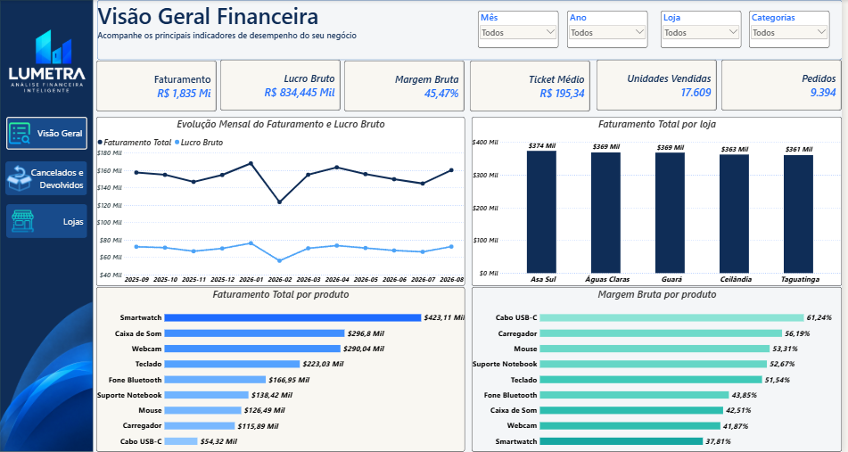
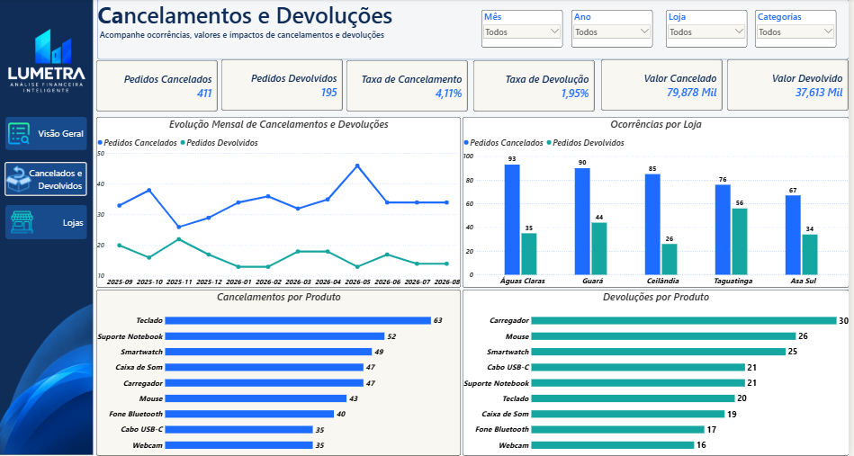
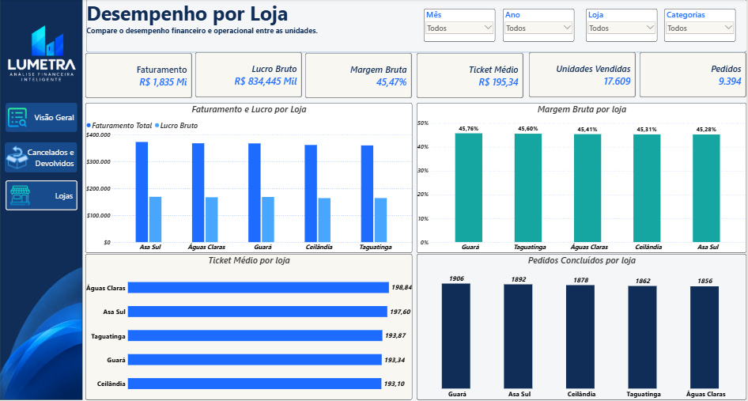

# 📊 Lumetra — Análise Financeira Inteligente com IA

Projeto de **Análise de Dados e Inteligência Artificial** desenvolvido para transformar dados financeiros em informações relevantes para análise e tomada de decisão.

O projeto utiliza **Python** para tratamento e análise dos dados, **Microsoft Power BI** para visualização dos indicadores e **Google Gemini API** para geração automatizada de análises financeiras.

---

## 🎯 Objetivo do Projeto

O objetivo é construir um fluxo completo de análise financeira, desde os dados brutos até a geração de insights utilizando Inteligência Artificial.

O projeto foi desenvolvido seguindo o fluxo:

**Dados brutos → Tratamento com Python → Análise financeira → Power BI → Gemini API → Análise estruturada com IA**

---

## 🏗️ Arquitetura do Projeto

```text
Dados brutos
     │
     ▼
Python + Pandas
     │
     ├── Limpeza dos dados
     ├── Tratamento de valores nulos
     ├── Tratamento de duplicidades
     ├── Padronização dos dados
     └── Criação dos indicadores
     │
     ▼
Dados tratados
     │
     ├───────────────► Power BI
     │                  │
     │                  ├── Visão Geral
     │                  ├── Lojas
     │                  └── Cancelamentos e Devoluções
     │
     ▼
Contexto financeiro
     │
     ▼
Google Gemini API
     │
     ▼
Análise financeira estruturada
     │
     ▼
JSON
```

---

# 🐍 Python — Tratamento e Análise dos Dados

A primeira etapa do projeto foi realizada utilizando **Python e Pandas**.

O processo envolveu:

- Importação dos dados brutos
- Análise inicial dos dados
- Tratamento de registros duplicados
- Tratamento de valores nulos
- Padronização das informações
- Criação e validação de indicadores
- Análise financeira
- Geração dos dados tratados para utilização no Power BI

Os dados tratados foram utilizados como base para as etapas seguintes do projeto.

---

# 📊 Dashboard — Power BI

O projeto possui um dashboard desenvolvido no **Microsoft Power BI** para visualização e acompanhamento dos principais indicadores financeiros.

## 1. Visão Geral

A página de visão geral apresenta os principais indicadores financeiros do negócio.

Entre os indicadores e análises apresentados estão:

- Faturamento
- Lucro bruto
- Margem bruta
- Ticket médio
- Unidades vendidas
- Pedidos
- Evolução mensal do faturamento e lucro
- Faturamento por loja
- Faturamento por produto
- Margem por produto



---

## 2. Cancelamentos e Devoluções

Dashboard destinado à análise dos cancelamentos e devoluções do negócio.



---

## 3. Análise por Lojas

Dashboard destinado à análise do desempenho financeiro das lojas.



---

# 🤖 Inteligência Artificial — Google Gemini API

Uma das principais etapas do projeto foi a integração com a **Google Gemini API**.

A IA recebe um contexto contendo os dados financeiros analisados pelo Python e é orientada a atuar como um analista financeiro.

O prompt solicita uma análise contendo:

1. Resumo do desempenho financeiro
2. Principais pontos positivos
3. Pontos que merecem atenção
4. Destaques por loja
5. Destaques por categoria
6. Conclusão executiva

A instrução também determina que a IA:

- Não invente informações
- Utilize somente os dados fornecidos
- Trabalhe com os indicadores disponíveis
- Retorne uma análise objetiva

Exemplo da integração:

```python
resposta = client.models.generate_content(
    model="models/gemini-3.5-flash",
    contents=prompt_ia
)

print(resposta.text)
```

---


---

# 📈 Principais Indicadores Analisados

Entre os principais indicadores financeiros trabalhados no projeto estão:

- Faturamento total
- Custo total
- Lucro bruto
- Margem bruta
- Ticket médio
- Unidades vendidas
- Quantidade de pedidos
- Faturamento mensal
- Lucro mensal
- Faturamento por loja
- Lucro por loja
- Margem por loja
- Faturamento por categoria
- Lucro por categoria
- Margem por categoria
- Cancelamentos
- Devoluções

---

# 🔎 Exemplo dos Resultados

Durante a análise, foram obtidos indicadores como:

**Faturamento total:** R$ 1.835.037,86

**Custo total:** R$ 1.000.593,00

**Lucro bruto:** R$ 834.444,86

**Margem bruta:** 45,47%

Também foram identificados destaques por loja e categoria, permitindo uma análise mais detalhada do desempenho financeiro.

---

# 🧠 O que foi aplicado no projeto

O projeto reúne conhecimentos de diferentes áreas de dados:

- 🐍 Python
- 🐼 Pandas
- 📊 Power BI
- 🤖 Inteligência Artificial Generativa
- 🔌 Consumo de API
- 📦 JSON
- 🧹 Tratamento e limpeza de dados
- 📈 Análise financeira
- 📊 Visualização de dados
- 🧠 Engenharia de Prompt
- 🔧 Git e GitHub

---

# 📁 Estrutura do Repositório

```text
lumetra-analise-financeira-ia/
│
├── Dados/
│   ├── Brutos/
│   │   └── vendas_brutas_ia_python.csv
│   │
│   ├── Tratado/
│   │   └── vendas_tratadas.csv
│   │
│   └── PowerBI/
│       └── base_financeira_powerbi.csv
│
├── PowerBI/
│   ├── Lumetra.pbix
│   ├── dashboard_visao_geral.png
│   ├── dashboard_lojas.png
│   └── dashboard_cancelamentos.png
│
├── analise_financeira.ipynb
│
├── requirements.txt
│
├── .gitignore
│
└── README.md
```

---

# ⚙️ Como Executar o Projeto

## 1. Clone o repositório

```bash
git clone https://github.com/LeticiaFelix0/lumetra-analise-financeira-ia.git
```

## 2. Entre na pasta

```bash
cd lumetra-analise-financeira-ia
```

## 3. Instale as dependências

```bash
pip install -r requirements.txt
```

## 4. Configure a API Key

Crie um arquivo `.env` na raiz do projeto:

```env
GEMINI_API_KEY=sua_chave_aqui
```

A chave da API **não deve ser publicada no GitHub**.

O arquivo `.env` está incluído no `.gitignore`.

## 5. Execute o notebook

Abra:

```text
analise_financeira.ipynb
```

e execute as células do projeto.

---

# 🔐 Segurança

Informações sensíveis, como a chave da API do Gemini, não são armazenadas no repositório.

O projeto utiliza um arquivo `.env` para armazenar a chave localmente:

```text
.env
```

Esse arquivo está incluído no `.gitignore` para evitar seu envio ao GitHub.

---

# 📌 Resultado Final

O projeto apresenta um fluxo completo de análise financeira:

```text
Dados
  ↓
Tratamento com Python
  ↓
Análise dos indicadores
  ↓
Power BI
  ↓
Contexto financeiro
  ↓
Google Gemini API
  ↓
Análise automatizada
  ↓
JSON estruturado
```

A proposta demonstra a aplicação integrada de **Análise de Dados, Business Intelligence e Inteligência Artificial Generativa** em um cenário de análise financeira.

---

# 👩‍💻 Autora

**Letícia Barreto Felix**

Estudante de Análise e Desenvolvimento de Sistemas, com foco em **Análise de Dados, Business Intelligence, Python, Power BI e Inteligência Artificial**.

---

⭐ Se este projeto foi útil ou interessante, fique à vontade para explorar o repositório.